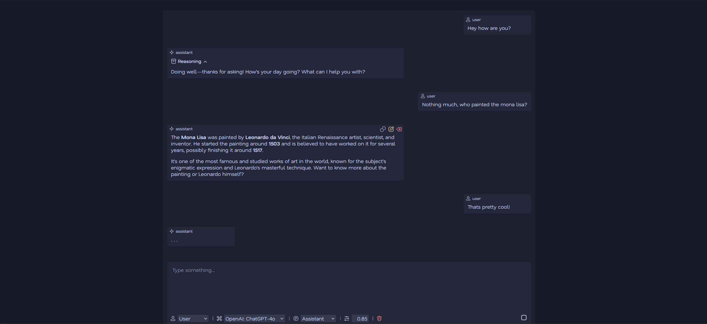

# whiskr



whiskr is a private, self-hosted web chat interface for interacting with AI models via [OpenRouter](https://openrouter.ai/).

## Features

- Private and self-hosted (data stored in localStorage)
- Supports any model available on your OpenRouter account
- Real-time streaming responses
- Edit, delete, or copy any message
- Persistent settings for model, temperature, and other parameters
- Full conversation control including clearing and modifying messages
- Smooth UI updates with [morphdom](https://github.com/patrick-steele-idem/morphdom), selections, images, and other state are preserved during updates
- Easy model selection:
  - Tags indicate if a model supports **tools**, **vision**, or **reasoning**
  - Search field with fuzzy matching to quickly find models
  - Models are listed newest -> oldest
- Web search tools (set the `EXA_TOKEN` to enable):
  - `search_web`: search via Exa in auto mode; returns up to 10 results with short summaries
  - `fetch_contents`: fetch page contents for one or more URLs via Exa /contents
- Images attachments for vision models using simple markdown image tags
- Text/Code file attachments
- Reasoning effort control
- Structured JSON output
- Statistics for messages (provider, ttft, tps and token count)
- Import and export of chats as JSON files
- Authentication (optional)

## TODO

- proper loading screen
- preload icons
- multiple chats

## Built With

**Frontend**
- Vanilla JavaScript and CSS
- [morphdom](https://github.com/patrick-steele-idem/morphdom) for DOM diffing without losing state
- [marked](https://github.com/markedjs/marked) for Markdown rendering
- [highlight.js](https://highlightjs.org/) for syntax highlighting
- Fonts: [Inter](https://rsms.me/inter/) (UI), [Comic Code](https://tosche.net/fonts/comic-code) (code)
- Icons: [SVGRepo](https://www.svgrepo.com/)
- Color palette: [Catppuccin Macchiato](https://catppuccin.com/)

**Backend**
- Go
- [OpenRouter](https://openrouter.ai/) for model list and completions
- [Exa](https://exa.ai/) for web search and content retrieval (`/search`, `/contents`)

## Getting Started

1. Copy `example.config.yml` to `config.yml` and set `tokens.openrouter`:
```bash
cp example.config.yml config.yml
```
2. Build and run:
```bash
go build -o whiskr
./whiskr
```
3. Open `http://localhost:3443` in your browser.

## Authentication (optional)

whiskr supports simple, stateless authentication. If enabled, users must log in with a username and password before accessing the chat. Passwords are hashed using bcrypt (12 rounds). If `authentication.enabled` is set to `false`, whiskr will not prompt for authentication at all.

```yaml
authentication:
  enabled: true
  users:
    - username: laura
      password: "$2a$12$cIvFwVDqzn18wyk37l4b2OA0UyjLYP1GdRIMYbNqvm1uPlQjC/j6e"
    - username: admin
      password: "$2a$12$mhImN70h05wnqPxWTci8I.RzomQt9vyLrjWN9ilaV1.GIghcGq.Iy"
```

After a successful login, whiskr issues a signed (HMAC-SHA256) token, using the server secret (`tokens.secret` in `config.yml`). This is stored as a cookie and re-used for future authentications.

## Usage

- Send a message with `Ctrl+Enter` or the send button
- Just add a message with the add button
- Hover over a message to edit, delete, or copy it
- Adjust model, temperature, prompt, or message role from the controls in the bottom-left
- Use the model search field to quickly find models (supports fuzzy matching)
- Look for tags in the model list to see if a model supports tools, vision, or reasoning
- Use `` in your message to display an image inline. If the model supports vision, the same image URL is passed to the model for multimodal input.

## License

GPL-3.0 see [LICENSE](LICENSE) for details.
