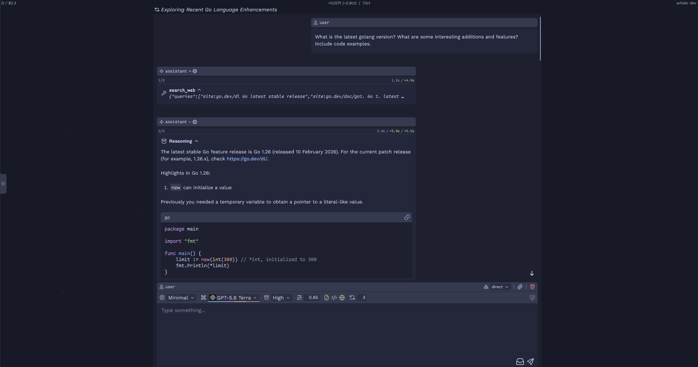
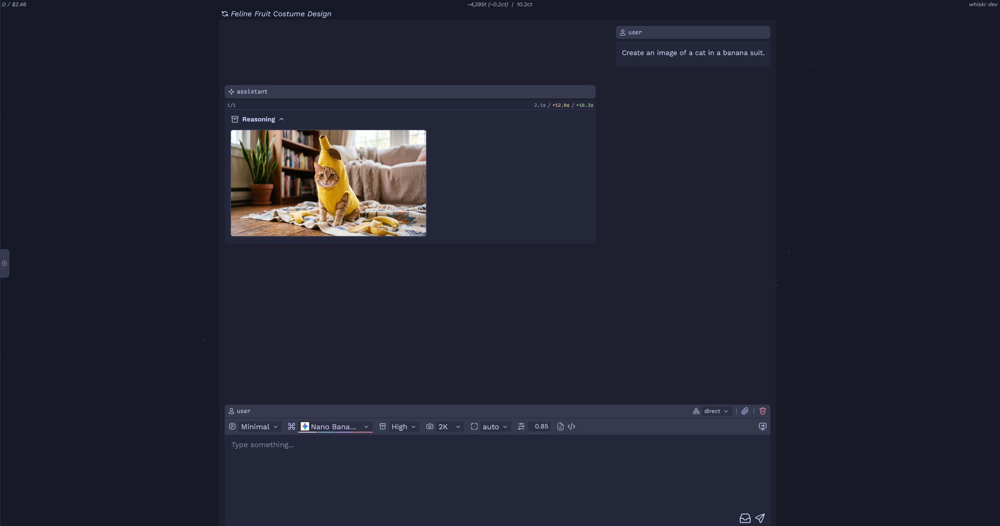
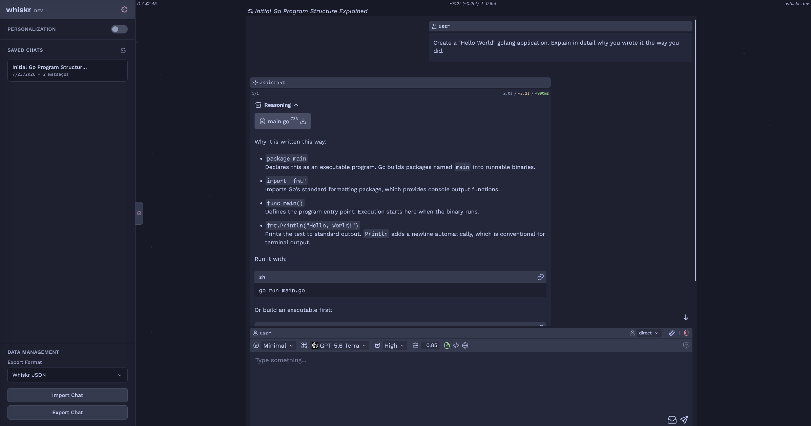
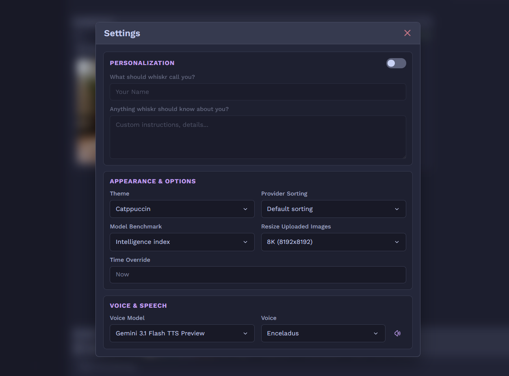

# whiskr



whiskr is a private, self-hosted web chat interface for interacting with AI models via [OpenRouter](https://openrouter.ai/).

## Features

### Core Functionality
- **Private & Self-Hosted**: All your data is stored in `indexedDB`.
- **Broad Model Support**: Use any model available on your OpenRouter account.
- **Real-time Responses**: Get streaming responses from models as they are generated.
- **Persistent Settings**: Your chosen model, temperature, provider sorting, theme and other parameters are saved between sessions.
- **Authentication**: Optional user/password authentication for added security.
- **Multimodal Output**: If a model supports image output, whiskr can request and render images alongside text, with resolution and aspect-ratio controls. You can enable/disable this globally via `models.image-generation` in `config.yml` (default: true).



- **File Output**: Models are able to emit text files themselves, which can be downloaded or previewed.
- **Text-to-Speech**: Select a voice model and voice to listen to assistant responses, with inline playback controls.



### Conversation Control
- **Full Message Control**: Edit, delete or copy any message in the conversation.
- **Collapse/Expand Messages**: Collapse large messages to keep your chat history tidy.
- **Retry & Regenerate**: Easily retry assistant responses or regenerate from any point in the conversation.
- **Title Generation**: Automatically generate (and refresh) a title for your chat.
- **Import & Export**: Save and load entire chats as local JSON files.
- **Structured Output**: Request JSON responses from models that support structured output.

### Rich UI & UX
- **File Attachments**: Attach text, code or images to your messages for vision-enabled models.
- **Reasoning & Transparency**:
  - View the model's thought process and tool usage in an expandable "Reasoning" section.
  - See detailed statistics for each message: provider, time-to-first-token, tokens-per-second, token count and cost.
  - Keep track of the total cost for the entire conversation.
- **Advanced Model Search**:
  - Tags indicate if a model supports **tools**, **vision** or **reasoning**.
  - Fuzzy matching helps you quickly find the exact model you need.
- **Personalization & Appearance**: Add custom instructions, choose from multiple themes, select provider sorting, compare model benchmarks, resize uploaded images or override the current time.
- **Smooth Interface**: Built with [morphdom](https://github.com/patrick-steele-idem/morphdom) to ensure UI updates don't lose your selections, scroll position or focus.



### Powerful Integrated Tools
- **`search_web`**: Search the web via Tavily; supports topic, recency and domain filters and returns relevant result snippets.
- **`fetch_contents`**: Fetch the contents of one or more URLs.
- **`github_repository`**: Get a comprehensive overview of a GitHub repository. The tool returns:
  - Core info (URL, description, stars, forks).
  - A list of top-level files and directories.
  - The full content of the repository's README file.

## Built With

**Frontend**
- Vanilla JavaScript and CSS
- [Rsbuild](https://rsbuild.rs/) for frontend builds
- [morphdom](https://github.com/patrick-steele-idem/morphdom) for DOM diffing without losing state
- [marked](https://github.com/markedjs/marked) for Markdown rendering
- [KaTeX](https://katex.org/) for math rendering
- [highlight.js](https://highlightjs.org/) for syntax highlighting
- [Dexie](https://dexie.org/) for IndexedDB persistence
- Fonts: Work Sans (ui), [Comic Code](https://tosche.net/fonts/comic-code) (code font)
- Icons: [SVGRepo](https://www.svgrepo.com/)
- Color palette: [Catppuccin Macchiato](https://catppuccin.com/)

**Backend**
- Go
- [chi/v5](https://go-chi.io/) for the http routing/server
- [OpenRouter](https://openrouter.ai/) for model list and completions
- [Tavily](https://www.tavily.com/) for web search and content retrieval (`/search`, `/extract`)

## Getting Started

1. Download the archive for your operating system and architecture from the [GitHub releases page](https://github.com/coalaura/whiskr/releases). Release archives are named `whiskr_<version>_<os>_<arch>.tar.gz` and are available for Windows and Linux on `amd64` and `arm64`.
2. Extract the archive:
```bash
tar -xzf whiskr_<version>_<os>_<arch>.tar.gz
```
3. Set `tokens.openrouter` in the included `config.yml`, then run whiskr:
```bash
./whiskr
```
On Windows, run `./whiskr.exe` instead.
4. Open `http://localhost:3443` in your browser.

Optional configuration notes (from `config.yml`):
- `models.image-generation` (bool, default: true) - allow models with image output to generate images. If set to false, whiskr requests text-only responses even for image-capable models.
- `models.text-to-speech` (bool, default: true) - enable text-to-speech voice synthesis and playback controls.
- `models.title-model` (string, default: `google/gemini-2.5-flash-lite`) - model used to generate chat titles (requires structured output support); set it to `-` to disable title generation.
- `models.transformation` (string, default: `middle-out`) - OpenRouter context transformation to use when a conversation exceeds the model context window.
- `models.filters` (string, optional) - boolean expression for filtering available models by `price`, `slug`, `name`, `tags` or `created`.
- `ui.reduced-motion` (bool, default: false) - disable animated effects such as the floating stars in the background.
- `tokens.tavily` (optional) - enables the search tools; without it, web search is unavailable.
- `tokens.github` (optional) - increases GitHub API limits for the GitHub repository tool.

## Authentication (optional)

whiskr supports simple, stateless authentication. If enabled, users must log in with a username and password before accessing the chat. Passwords are hashed using bcrypt (12 rounds). If `authentication.enabled` is set to `false`, whiskr will not prompt for authentication at all.

```yaml
authentication:
  enabled: true
  users:
    - username: laura
      password: "$2a$12$cIvFwVDqzn18wyk37l4b2OA0UyjLYP1GdRIMYbNqvm1uPlQjC/j6e"
    - username: admin
      password: "$2a$12$mhImN70h05wnqPxWTci8I.RzomQt9vyLrjWN9ilaV1.GIghcGq.Iy"
```

After a successful login, whiskr issues a signed (HMAC-SHA256) token, using the server secret (`tokens.secret` in `config.yml`). This is stored as a cookie and re-used for future authentications.

## Proxy (optional)

Release archives include `whiskr_proxy`, a small authenticated proxy that forwards whiskr's OpenRouter requests. Deploy it on a machine or VPS in the region from which you want OpenRouter requests to originate. The proxy host uses its own `config.yml`:

```yaml
server:
  port: 4334
  token: "generated-on-first-start"
```

On its first start, the proxy generates `server.token` if it is empty and saves it to the proxy host's `config.yml`. Copy that generated token into the whiskr instance's `config.yml`, then select the proxy from the chat controls:

```yaml
proxies:
  - name: remote
    host: https://proxy.example.com
    token: "copy-the-proxy-server-token-here"
```

The proxy listens on port `4334` by default and forwards only requests to `openrouter.ai`. Use HTTPS or private networking between whiskr and the remote proxy.

For example, if a model is available only to requests originating in the United States, you can deploy `whiskr_proxy` on a US VPS and select it in the frontend. Configure additional proxies for other regions and switch between them from the chat controls. Model availability remains subject to OpenRouter and the provider's access rules.

## Nginx (optional)

When running behind a reverse proxy like nginx, you can have the proxy serve static files.

```nginx
server {
    listen 443 ssl;
    server_name chat.example.com;
    http2 on;

    root /path/to/whiskr/static;

    location / {
        index index.html index.htm;

        etag on;
        add_header Cache-Control "public, max-age=2592000, must-revalidate";
        expires 30d;
    }

    location ~ ^/- {
        proxy_pass       http://127.0.0.1:3443;
        proxy_set_header X-Forwarded-For $remote_addr;
        proxy_set_header Host            $host;
    }

    ssl_certificate /path/to/cert.pem;
    ssl_certificate_key /path/to/key.pem;
}
```

## Usage

- Send a message with `Ctrl+Enter` or the send button.
- Hover over a message to reveal controls to **edit, delete, copy, collapse or retry**.
- Click **"Reasoning"** on an assistant message to view the model's thought process or tool usage.
- Adjust model, temperature, prompt or message role from the controls in the bottom-left.
- Open **Settings** to personalize your prompts, select a theme, choose provider sorting and model benchmarks, resize uploaded images, configure text-to-speech or override the current time.
- **Custom Prompts**: The `extra` folder contains additional pre-made system prompts. You can copy these into the main `prompts` folder if you want to use them alongside the default built-in prompts.
- Attach images using markdown syntax (``) or upload text/code files with the attachment button.
- When using an **image-output model** and `models.image-generation` is enabled, whiskr will display returned images inline and lets you select an image resolution and aspect ratio.
- Enable **JSON** to request structured JSON output from compatible models or enable **Search** to allow web search and page fetching.
- Use the buttons in the top-right to **import/export** the chat or clear all messages.

## License

GPL-3.0 see [LICENSE](LICENSE) for details.
