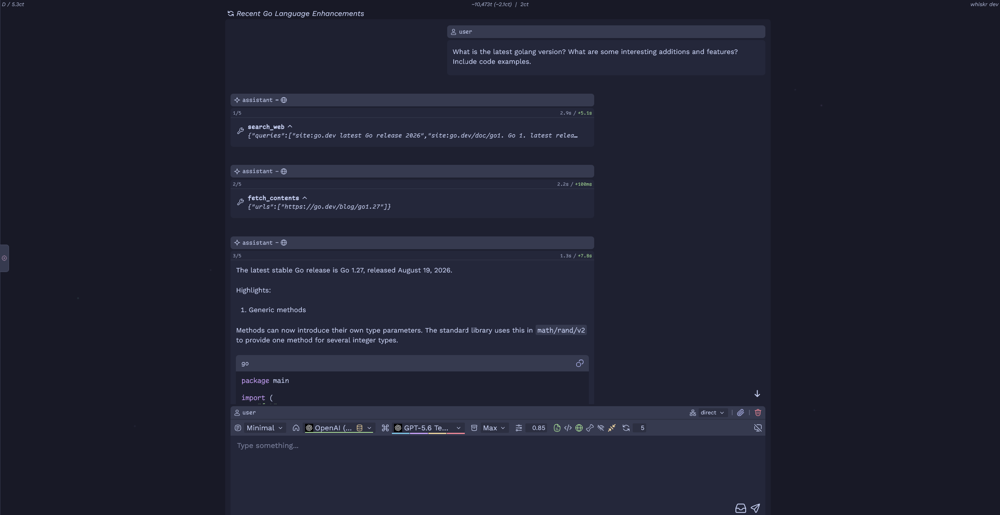
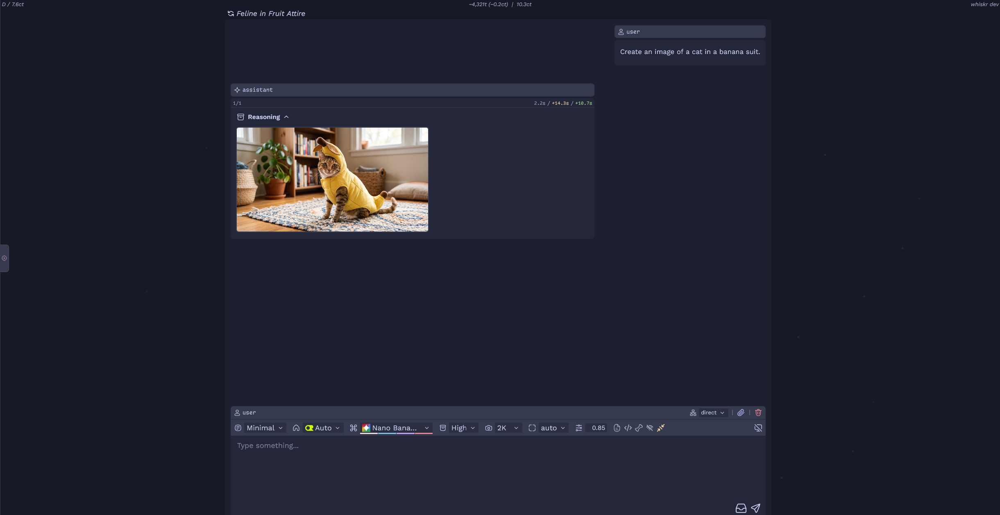
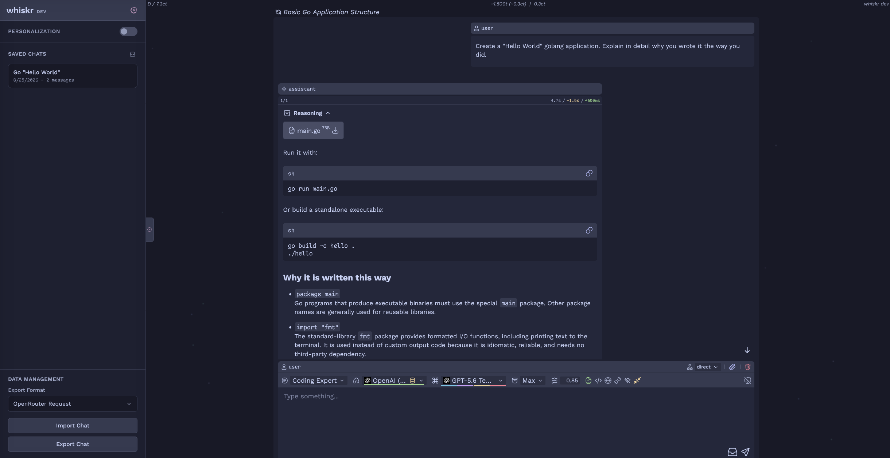
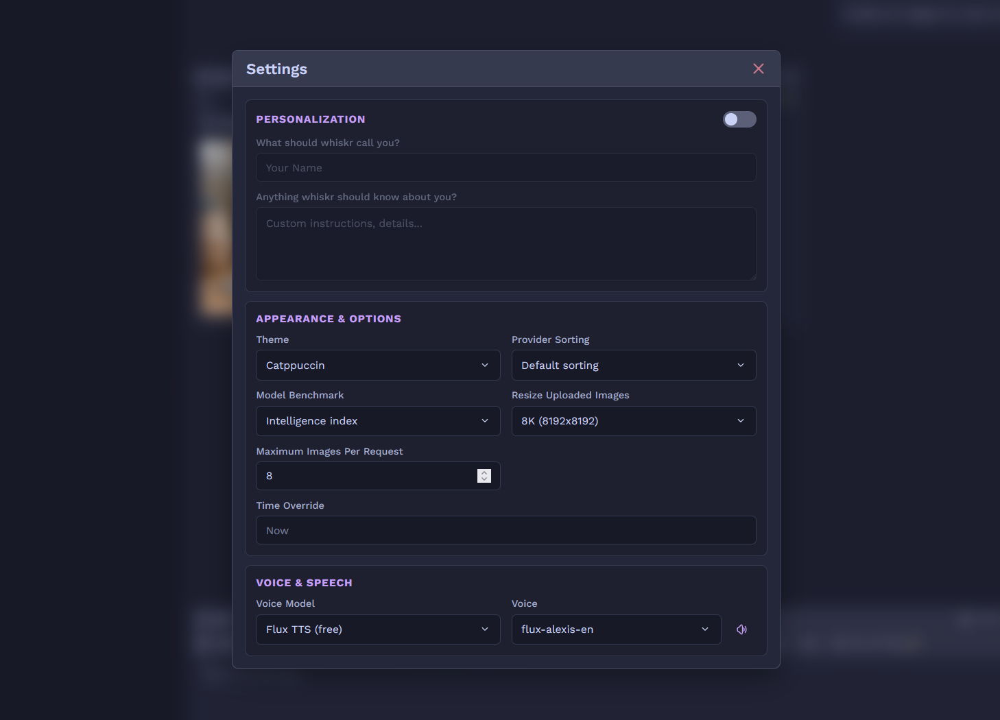

# whiskr



whiskr is a private, self-hosted web chat interface for interacting with AI models via [OpenRouter](https://openrouter.ai/) or an OpenAI-compatible API.

## Features

### Core Functionality
- **Private & Self-Hosted**: Conversations, attachments, saved chats and UI settings are stored locally in your browser using IndexedDB. When authentication is enabled, model favorites are also synced per user through the server's `settings.yml`.
- **Broad Model Support**: Use models from OpenRouter or a configured OpenAI-compatible endpoint.
- **Real-time Responses**: Get streaming responses from models as they are generated.
- **Persistent Settings**: Your chosen model, temperature, provider sorting, theme and other parameters are saved between sessions.
- **Authentication**: Optional user/password authentication for added security.
- **Multimodal Output**: If a model supports image output, whiskr can request and render images alongside text, with resolution and aspect-ratio controls. You can enable/disable this globally via `models.image-generation` in `config.yml` (default: true).



- **File Output**: Models are able to emit text files themselves, which can be downloaded or previewed.
- **Text-to-Speech**: Select a voice model and voice to listen to assistant responses, with inline playback controls.



### Conversation Control
- **Full Message Control**: Change the role, edit, delete or copy any message in the conversation, or add a message without immediately starting a completion.
- **Collapse/Expand Messages**: Collapse large messages to keep your chat history tidy.
- **Retry & Regenerate**: Easily retry assistant responses or regenerate from any point in the conversation.
- **Title Generation**: Automatically generate (and refresh) a title for your chat.
- **Saved Chats**: Save named chats in the browser, then load, overwrite or delete them from the sidebar.
- **Import & Export**: Import whiskr JSON and export chats as whiskr JSON, an OpenRouter request, Markdown or HTML.
- **Structured Output**: Request JSON responses from models that support structured output.

### Rich UI & UX
- **File Attachments**: Attach, paste, reorder or remove text, code and images. Images can also be inserted inline for vision-enabled models.
- **Reasoning & Transparency**:
  - View the model's thought process and tool usage in an expandable "Reasoning" section.
  - See detailed statistics for each message: provider, time-to-first-token, tokens-per-second, token count and cost.
  - Keep track of the total cost for the entire conversation.
- **Advanced Model Search**:
  - Tags indicate if a model supports **tools**, **vision**, **reasoning**, structured output or image generation.
  - Search models, mark favorites and, on OpenRouter, inspect or pin providers using price, throughput, uptime, quantization and privacy metadata.
- **Personalization & Appearance**: Add custom instructions, choose from multiple themes, select provider sorting, compare model benchmarks, resize uploaded images or override the current time.
- **Request Controls**: Configure reasoning effort or token limits, tool iterations and auto-scrolling, or enable bare-bones, offline-simulation and context-compression modes when supported.
- **Responsive Interface**: The chat, sidebar, settings and searchable dropdowns adapt for desktop, tablet and mobile screens.
- **Smooth Interface**: Built with [morphdom](https://github.com/patrick-steele-idem/morphdom) to ensure UI updates don't lose your selections, scroll position or focus.



### Powerful Integrated Tools
- **`search_web`**: Search the web via Tavily; supports topic, recency and domain filters and returns relevant result snippets.
- **`fetch_contents`**: Fetch the contents of one or more URLs.
- **`github_repository`**: Get a comprehensive overview of a GitHub repository. The tool returns:
  - Core info (URL, description, stars, forks).
  - Up to 256 entries from the recursive repository tree, filtered and ordered to keep the result compact.
  - The full content of the repository's README file.

## Built With

**Frontend**
- Vanilla JavaScript and CSS
- [Rsbuild](https://rsbuild.rs/) for frontend builds
- [morphdom](https://github.com/patrick-steele-idem/morphdom) for DOM diffing without losing state
- [marked](https://github.com/markedjs/marked) for Markdown rendering
- [KaTeX](https://katex.org/) for math rendering
- [highlight.js](https://highlightjs.org/) for syntax highlighting
- [Dexie](https://dexie.org/) for IndexedDB persistence
- Fonts: Work Sans (ui), [Comic Code](https://tosche.net/fonts/comic-code) (code font)
- Icons: [SVGRepo](https://www.svgrepo.com/)
- Color palette: [Catppuccin Macchiato](https://catppuccin.com/)

**Backend**
- Go
- [chi/v5](https://go-chi.io/) for the http routing/server
- [OpenRouter](https://openrouter.ai/) or an OpenAI-compatible API for model lists and completions
- [Tavily](https://www.tavily.com/) for web search and content retrieval (`/search`, `/extract`)

## Getting Started

1. Download the archive for your operating system and architecture from the [GitHub releases page](https://github.com/coalaura/whiskr/releases). Release archives are named `whiskr_<version>_<os>_<arch>.tar.gz` and are available for Windows and Linux on `amd64` and `arm64`.
2. Extract the archive:
```bash
tar -xzf whiskr_<version>_<os>_<arch>.tar.gz
```
3. Set `tokens.openrouter` in the included `config.yml`. Alternatively, set `llm.api` to `openai` and configure `tokens.openai` and `llm.base-url` for an OpenAI-compatible endpoint. Then run whiskr:
```bash
./whiskr
```
On Windows, run `./whiskr.exe` instead.
4. Open `http://localhost:3443` in your browser.

Optional configuration notes (from `config.yml`):
- `debug` (bool, default: false) - enable verbose diagnostics and write completion/title request bodies to local JSON files.
- `server.port` (int, default: `3443`) - port used by the web server.
- `settings.timeout` (int, default: `1200`) - completion request timeout in seconds.
- `settings.refresh-interval` (int, default: `30`) - model-list refresh interval in minutes.
- `llm.api` (`openrouter` or `openai`, default: `openrouter`) - select OpenRouter or an OpenAI-compatible API.
- `llm.base-url` (string) - API base URL; defaults to OpenRouter or OpenAI according to `llm.api`.
- `models.image-generation` (bool, default: true) - allow models with image output to generate images. If set to false, whiskr requests text-only responses even for image-capable models.
- `models.text-to-speech` (bool, default: true) - enable text-to-speech voice synthesis and playback controls.
- `models.title-model` (string, default: `google/gemini-2.5-flash-lite`) - model used to generate chat titles (requires structured output support); set it to `-` to disable title generation.
- `models.transformation` (string, default: `middle-out`) - OpenRouter context transformation to use when a conversation exceeds the model context window.
- `models.filters` (string, optional) - boolean expression for filtering available models by `price`, `slug`, `name`, `tags` or `created`.
- `ui.reduced-motion` (bool, default: false) - disable animated effects such as the floating stars in the background.
- `tokens.tavily` (optional) - enables the search tools; without it, web search is unavailable.
- `tokens.github` (optional) - increases GitHub API limits for the GitHub repository tool.

## Desktop (optional)

Desktop releases open the chat in a native app window with the web UI embedded in the binary, so no `public` folder is needed. Windows releases use an installer; Linux releases use an AppImage; and macOS releases use an app bundle. On first launch, whiskr creates and opens the user config. Set `tokens.openrouter`, save the file and launch whiskr again. On Windows, the config is stored at `%APPDATA%\\whiskr\\config.yml`.

The desktop app requires a native webview runtime:
- **Windows**: WebView2, which is preinstalled on Windows 10/11.
- **Linux**: GTK and WebKitGTK must be installed as system packages (e.g. `libwebkit2gtk-4.1-0` on Debian/Ubuntu, `webkit2gtk-4.1` on Fedora, `webkit2gtk` on Arch).

## Authentication (optional)

whiskr supports simple, stateless authentication. If enabled, users must log in with a username and password before accessing the chat. Passwords are hashed using bcrypt. Plaintext values prefixed with `text=` are hashed with bcrypt's default cost when whiskr starts. If `authentication.enabled` is set to `false`, whiskr will not prompt for authentication at all.

```yaml
authentication:
  enabled: true
  users:
    - username: laura
      password: "$2a$12$cIvFwVDqzn18wyk37l4b2OA0UyjLYP1GdRIMYbNqvm1uPlQjC/j6e"
    - username: admin
      password: "$2a$12$mhImN70h05wnqPxWTci8I.RzomQt9vyLrjWN9ilaV1.GIghcGq.Iy"
```

After a successful login, whiskr issues an HMAC-SHA3-512-signed token using the server secret (`tokens.secret` in `config.yml`). This is stored as a cookie and re-used for future authentications.

## Proxy (optional)

Release archives include `whiskr_proxy`, a small authenticated proxy that forwards whiskr's OpenRouter requests. Deploy it on a machine or VPS in the region from which you want OpenRouter requests to originate. The proxy host uses its own `config.yml`:

```yaml
server:
  port: 4334
  token: "generated-on-first-start"
```

On its first start, the proxy generates `server.token` if it is empty and saves it to the proxy host's `config.yml`. Copy that generated token into the whiskr instance's `config.yml`, then select the proxy from the chat controls:

```yaml
proxies:
  - name: remote
    host: https://proxy.example.com
    token: "copy-the-proxy-server-token-here"
```

The proxy listens on port `4334` by default and forwards only requests to `openrouter.ai`. Use HTTPS or private networking between whiskr and the remote proxy.

For example, if a model is available only to requests originating in the United States, you can deploy `whiskr_proxy` on a US VPS and select it in the frontend. Configure additional proxies for other regions and switch between them from the chat controls. Model availability remains subject to OpenRouter and the provider's access rules.

## Nginx (optional)

When running behind a reverse proxy like nginx, you can have the proxy serve static files.

```nginx
server {
    listen 443 ssl;
    server_name chat.example.com;
    http2 on;

    root /path/to/whiskr/static;

    location / {
        index index.html index.htm;

        etag on;
        add_header Cache-Control "public, max-age=2592000, must-revalidate";
        expires 30d;
    }

    location ~ ^/- {
        proxy_pass       http://127.0.0.1:3443;
        proxy_set_header X-Forwarded-For $remote_addr;
        proxy_set_header Host            $host;
    }

    ssl_certificate /path/to/cert.pem;
    ssl_certificate_key /path/to/key.pem;
}
```

## Usage

- Send a message with `Ctrl+Enter` or the send button.
- Hover over a message to reveal controls to change its role, **edit, delete, copy, collapse or retry**. Assistant messages can also copy detailed developer statistics.
- Click **"Reasoning"** on an assistant message to view the model's thought process or tool usage.
- Adjust model, temperature, prompt or message role from the controls in the bottom-left.
- Open **Settings** to personalize your prompts, select a theme, choose provider sorting and model benchmarks, resize uploaded images, configure text-to-speech or override the current time.
- **Custom Prompts**: The `extra` folder contains additional pre-made system prompts. You can copy these into the main `prompts` folder if you want to use them alongside the default built-in prompts.
- Attach images using markdown syntax (``), paste or upload images, or upload text/code files with the attachment button. Attachments can be reordered before sending; hold `Shift` while choosing an image to insert it inline.
- When using an **image-output model** and `models.image-generation` is enabled, whiskr will display returned images inline and lets you select an image resolution and aspect ratio.
- Enable **JSON** to request structured JSON output from compatible models or enable **Search** to allow web search and page fetching. The adjacent controls toggle text-file output, bare-bones mode, offline simulation and context compression.
- Open the sidebar to save chats or **import/export** the current chat. Use the clear button in the composer header to remove all messages.

## License

GPL-3.0 see [LICENSE](LICENSE) for details.
