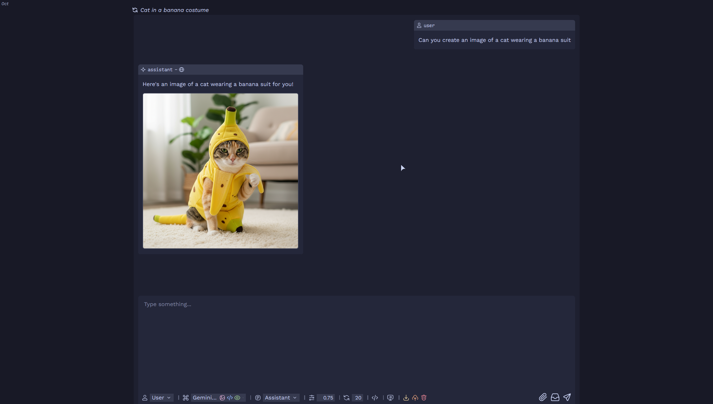

# whiskr


whiskr is a private, self-hosted web chat interface for interacting with AI models via [OpenRouter](https://openrouter.ai/).

## Features

### Core Functionality
- **Private & Self-Hosted**: All your data is stored in `indexedDB`.
- **Broad Model Support**: Use any model available on your OpenRouter account.
- **Real-time Responses**: Get streaming responses from models as they are generated.
- **Persistent Settings**: Your chosen model, temperature, and other parameters are saved between sessions.
- **Authentication**: Optional user/password authentication for added security.
- Multimodal Output: If a model supports image output (for example, `google/gemini-2.5-flash-image-preview`), whiskr will request and render images alongside text. You can enable/disable this globally via `settings.image-generation` in `config.yml` (default: true).



### Conversation Control
- **Full Message Control**: Edit, delete, or copy any message in the conversation.
- **Collapse/Expand Messages**: Collapse large messages to keep your chat history tidy.
- **Retry & Regenerate**: Easily retry assistant responses or regenerate from any point in the conversation.
- **Title Generation**: Automatically generate (and refresh) a title for your chat.
- **Import & Export**: Save and load entire chats as local JSON files.

### Rich UI & UX
- **File Attachments**: Attach text, code, or images to your messages for vision-enabled models.
- **Reasoning & Transparency**:
  - View the model's thought process and tool usage in an expandable "Reasoning" section.
  - See detailed statistics for each message: provider, time-to-first-token, tokens-per-second, token count, and cost.
  - Keep track of the total cost for the entire conversation.
- **Advanced Model Search**:
  - Tags indicate if a model supports **tools**, **vision**, or **reasoning**.
  - Fuzzy matching helps you quickly find the exact model you need.
- **Smooth Interface**: Built with [morphdom](https://github.com/patrick-steele-idem/morphdom) to ensure UI updates don't lose your selections, scroll position, or focus.

### Powerful Integrated Tools
- **`search_web`**: Search the web via Exa; returns up to 12 results with short summaries.
- **`fetch_contents`**: Fetch and summarize the contents of one or more URLs.
- **`github_repository`**: Get a comprehensive overview of a GitHub repository. The tool returns:
  - Core info (URL, description, stars, forks).
  - A list of top-level files and directories.
  - The full content of the repository's README file.

## TODO

- restrict model list (optionally allow all for authenticated users)
- make authentication optional (unless no allowed models)
- improved custom prompts
- settings
  - auto-retry on edit
  - ctrl+enter vs enter for sending
- multiple chats

## Built With

**Frontend**
- Vanilla JavaScript and CSS
- [morphdom](https://github.com/patrick-steele-idem/morphdom) for DOM diffing without losing state
- [marked](https://github.com/markedjs/marked) for Markdown rendering
- [highlight.js](https://highlightjs.org/) for syntax highlighting
- Fonts: [Inter](https://rsms.me/inter/) (UI), [Comic Code](https://tosche.net/fonts/comic-code) (code)
- Icons: [SVGRepo](https://www.svgrepo.com/)
- Color palette: [Catppuccin Macchiato](https://catppuccin.com/)

**Backend**
- Go
- [chi/v5](https://go-chi.io/) for the http routing/server
- [OpenRouter](https://openrouter.ai/) for model list and completions
- [Exa](https://exa.ai/) for web search and content retrieval (`/search`, `/contents`)

## Getting Started

1. Copy `example.config.yml` to `config.yml` and set `tokens.openrouter`:
```bash
cp example.config.yml config.yml
```
2. Build and run:
```bash
go build -o whiskr
./whiskr
```
3. Open `http://localhost:3443` in your browser.

Optional configuration notes (from `config.yml`):
- `settings.image-generation` (bool, default: true) - allow models with image output to generate images. If set to false, whiskr requests text-only responses even for image-capable models.
- `settings.title-model` (string, default: `google/gemini-2.5-flash-lite`) - model used to generate chat titles (requires structured output support).
- `tokens.exa` (optional) - enables the search tools; without it, web search is unavailable.
- `tokens.github` (optional) - increases GitHub API limits for the GitHub repository tool.

## Authentication (optional)

whiskr supports simple, stateless authentication. If enabled, users must log in with a username and password before accessing the chat. Passwords are hashed using bcrypt (12 rounds). If `authentication.enabled` is set to `false`, whiskr will not prompt for authentication at all.

```yaml
authentication:
  enabled: true
  users:
    - username: laura
      password: "$2a$12$cIvFwVDqzn18wyk37l4b2OA0UyjLYP1GdRIMYbNqvm1uPlQjC/j6e"
    - username: admin
      password: "$2a$12$mhImN70h05wnqPxWTci8I.RzomQt9vyLrjWN9ilaV1.GIghcGq.Iy"
```

After a successful login, whiskr issues a signed (HMAC-SHA256) token, using the server secret (`tokens.secret` in `config.yml`). This is stored as a cookie and re-used for future authentications.

## Nginx (optional)

When running behind a reverse proxy like nginx, you can have the proxy serve static files.

```nginx
server {
    listen 443 ssl;
    server_name chat.example.com;
    http2 on;

    root /path/to/whiskr/static;

    location / {
        index index.html index.htm;

        etag on;
        add_header Cache-Control "public, max-age=2592000, must-revalidate";
        expires 30d;
    }

    location ~ ^/- {
        proxy_pass       http://127.0.0.1:3443;
        proxy_set_header X-Forwarded-For $remote_addr;
        proxy_set_header Host            $host;
    }

    ssl_certificate /path/to/cert.pem;
    ssl_certificate_key /path/to/key.pem;
}
```

## Usage

- Send a message with `Ctrl+Enter` or the send button.
- Hover over a message to reveal controls to **edit, delete, copy, collapse, or retry**.
- Click **"Reasoning"** on an assistant message to view the model's thought process or tool usage.
- Adjust model, temperature, prompt, or message role from the controls in the bottom-left.
- Attach images using markdown syntax (``) or upload text/code files with the attachment button.
- When using an **image-output model** (e.g., `google/gemini-2.5-flash-image-preview`) and `settings.image-generation` is enabled, whiskr will display returned images inline.
- Use the buttons in the top-right to **import/export** the chat or clear all messages.

## License

GPL-3.0 see [LICENSE](LICENSE) for details.