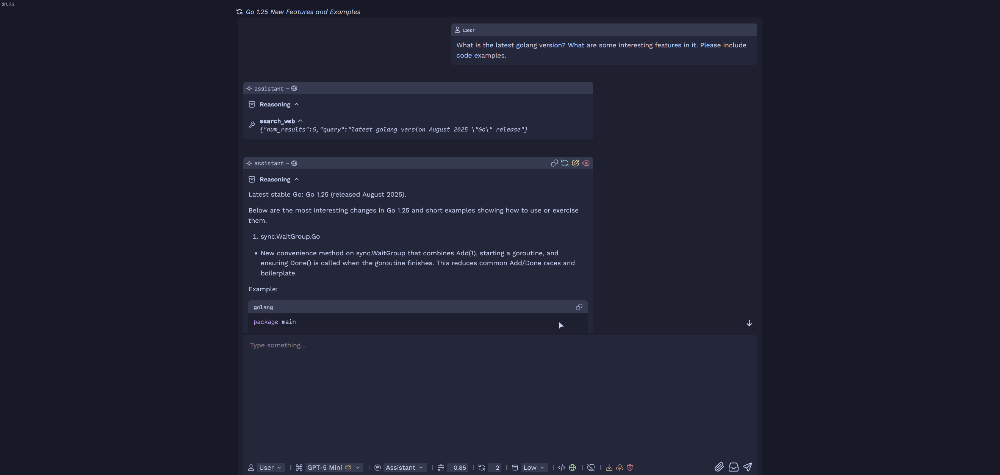

# whiskr



whiskr is a private, self-hosted web chat interface for interacting with AI models via [OpenRouter](https://openrouter.ai/).

## Features

- Private and self-hosted (data stored in localStorage)
- Supports any model available on your OpenRouter account
- Real-time streaming responses
- Edit, delete, or copy any message
- Persistent settings for model, temperature, and other parameters
- Full conversation control including clearing and modifying messages

## TODO

- Image and file attachments
- Reasoning effort control
- Web search tool
- Import and export of chats

## Built With

**Frontend**
- Vanilla JavaScript and CSS
- [marked](https://github.com/markedjs/marked) for Markdown rendering
- [highlight.js](https://highlightjs.org/) for syntax highlighting
- Fonts: [Inter](https://rsms.me/inter/) (UI), [Comic Code](https://tosche.net/fonts/comic-code) (code)
- Icons: [SVGRepo](https://www.svgrepo.com/)
- Color palette: [Catppuccin Macchiato](https://catppuccin.com/)

**Backend**
- Go
- [OpenRouter](https://openrouter.ai/) for model list and completions

## Getting Started

1. Copy `.example.env` to `.env` and set `OPENROUTER_TOKEN`:
```bash
cp .example.env .env
```
2. Build and run:
```bash
go build -o whiskr
./whiskr
```
3. Open `http://localhost:3443` in your browser.

## Usage

- Send a message with `Ctrl+Enter` or the send button
- Just add a message with the add button
- Hover over a message to edit, delete, or copy it
- Adjust model, temperature, prompt, or message role from the controls in the bottom-left

## License

GPL-3.0 see [LICENSE](LICENSE) for details.
